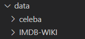

### data

IMDB-WIKI数据集放在data文件夹下，图像大小64x64



CelebA数据集存储结构如下。分为train, test, eval三部分，其中设置了10个client，所以0-9分别对应各个client的train和test数据。0和1分别对应女性和男性的分类。图像大小64x64


### 训练流程

1. 使用IMDB-WIKI数据集进行VAE预训练
2. 在预训练模型的基础上，使用CelebA数据集上进行少量轮次的训练，得到VAE模型权重
3. 对每一个client进行属性控制

### 关键文件

#### gen_imgs.py

使用训练的权重文件，测试VAE的生成效果

#### train_distribute.py

使用DDP多卡训练VAE

使用IMDB-WIKI数据集训练的权重保存在：checkpoints/IMDB-WIKI_160_DDP/

生成的图像保存在：output/DDP/

```python
python train_distirbute.py
```

#### train.py

使用单卡训练VAE

假设有10个client，每个client都有部分的CelebA数据集，要为每一个client训练一个VAE

使用CelebA数据集训练的权重保存在：checkpoints/celeba

生成的图像保存在：output/celeba

```python
python train.py
```

#### vae_attribute_manipulate.py

使用上面VAE的权重对图像进行属性的控制

分别使用10个client的VAE模型权重，对每个client的数据进行修改

compute_attribute_vector函数用于分离属性向量

trans_attributes函数向图像中添加属性

### 致谢

CelebA数据集

IMDB-WIKI数据集

nvae代码源自于[GlassyWing/nvae: An unofficial toy implementation for NVAE 《A Deep Hierarchical Variational Autoencoder》 (github.com)](https://github.com/GlassyWing/nvae)

Federated learning代码使用FedML
